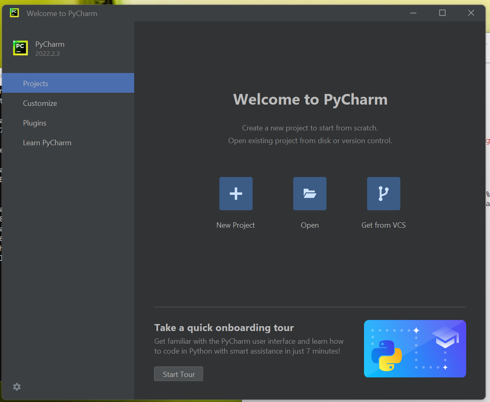
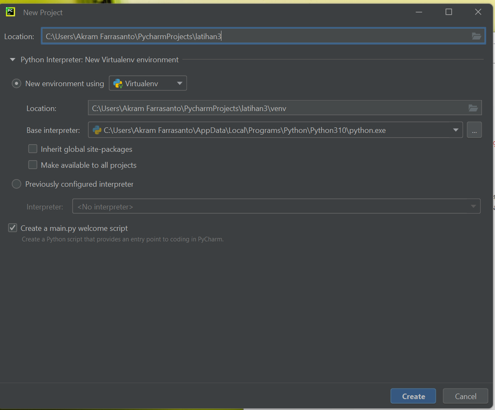
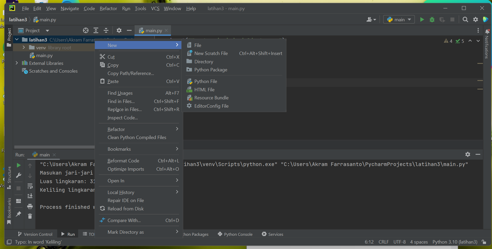
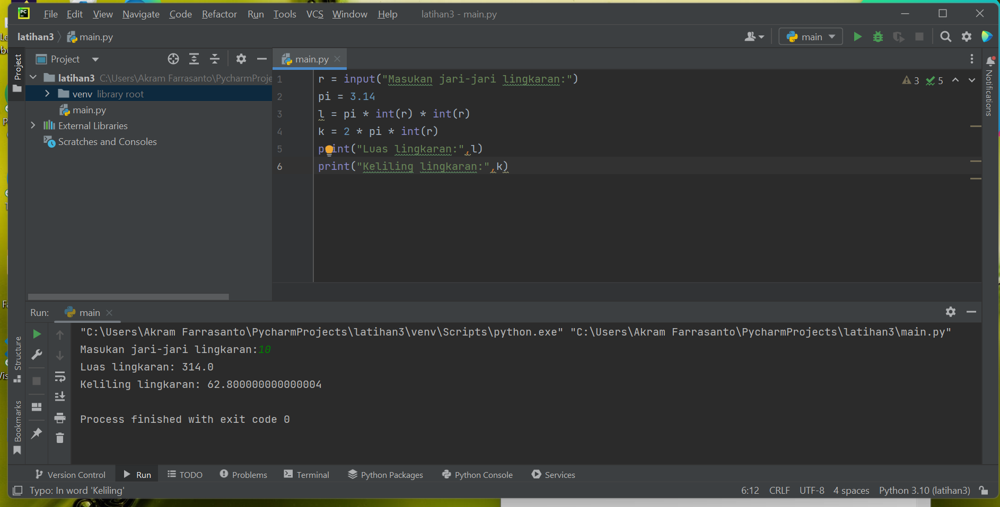

## Menjalankan Python Console 

#### - Menampilkan tulisan "Hello World" dilayar.
#### - Menampilkan tulisan "Saya Sedang Belajar Python" dilayar.

## Menjumlahkan dua buah bilangan menggunakan variabel a dan b.

#### - Mendefinisikan variable a dengan nilai 8
#### - Mendefinisikan variable b dengan nilai 6
#### - Mencetak nilai variable a dan b 
#### - Mencetak hasil penjumlahan a+b

## Menjalankan IDLE

#### - Membuat file baru dengan nama latihan3.py (pastikan lokasi file pada folder lap2py pada direktori kerja anda)
#### - Menggunakan fungsi input untuk mengambil nilai variabel dari keyboard.

## PyCharm

### https://www.jetbrains.com/pycharm/

## Virtual Environment (Venv)

## Menambahkan File Baru

#### - Main.py

## Menjalankan Program

